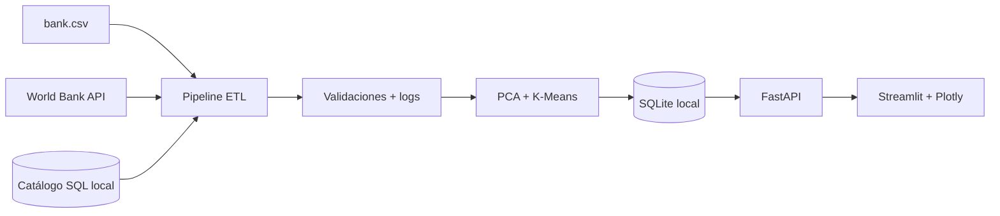

# Arquitectura técnica

## Propósito

La solución integra datos de campañas bancarias y los transforma en información analítica consultable mediante una API propia y un dashboard interactivo.

## Fuentes integradas

| N° | Fuente | Formato | Función |
|---:|---|---|---|
| 1 | `data/raw/bank.csv` | CSV | Datos principales de clientes y resultados de campañas. |
| 2 | World Bank Indicators API | REST JSON | Contexto macroeconómico de Portugal: desempleo, inflación y crecimiento del PIB. |
| 3 | `contact_channel_reference` | SQL local | Catálogo de canales utilizado para enriquecer los registros durante la transformación. |

## Flujo end-to-end

## Decisiones de diseño

- **SQLite local:** reduce la fricción de instalación y permite ejecutar la solución completa sin configurar servidores de base de datos.
- **API externa con caché:** el pipeline reintenta las consultas y, ante problemas de red, utiliza el último respaldo disponible.
- **FastAPI propia:** desacopla la visualización de la base de datos y ofrece documentación automática en `/docs`.
- **Streamlit + Plotly:** permite construir un dashboard interactivo simple de ejecutar y consistente con los contenidos vistos en clases.
- **Segmentación exploratoria:** PCA y K-Means permiten analizar perfiles de clientes sin presentar el resultado como una predicción causal.

## Trazabilidad

Cada ejecución registra identificador, fecha de inicio, fecha de término, estado, filas procesadas, origen de los indicadores externos y mensaje de error cuando corresponde.
